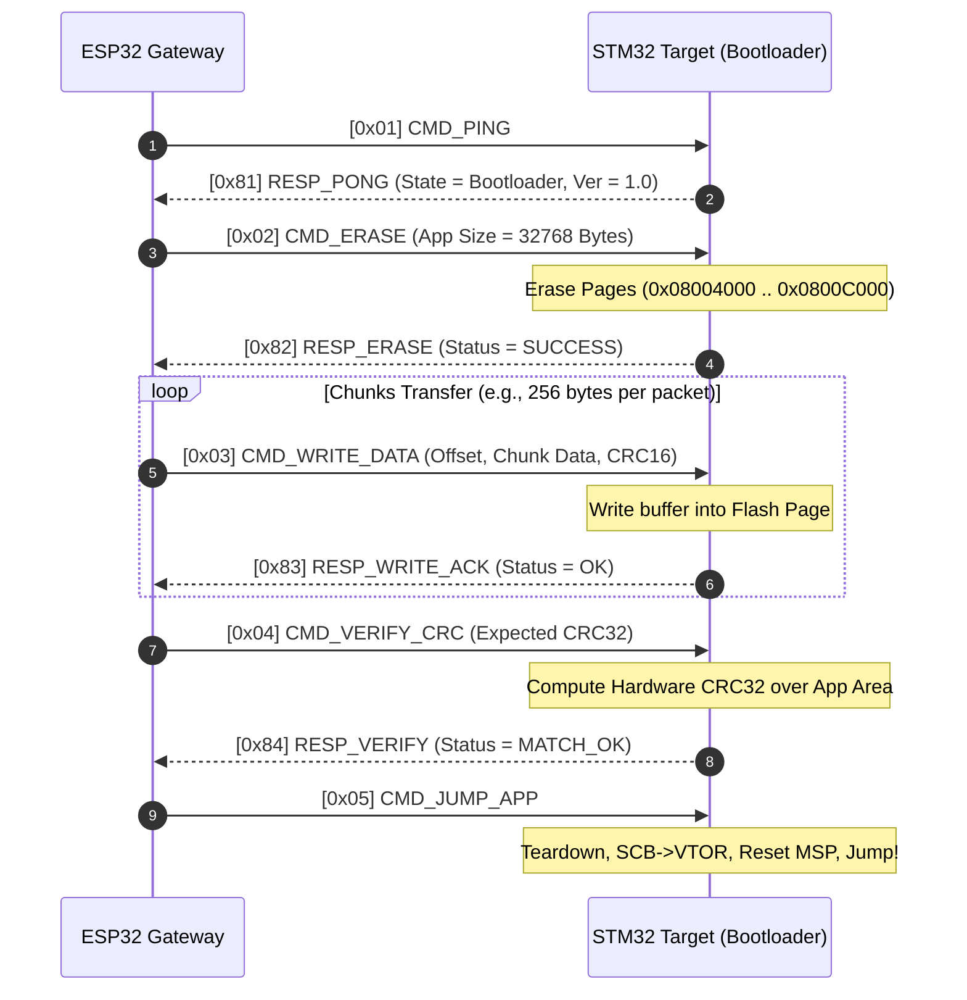

# STM32 UART Bootloader & ESP32 Wireless Gateway

[-002B49?logo=stmicroelectronics)](https://www.st.com)
[](https://www.espressif.com)
[](https://en.wikipedia.org/wiki/Universal_asynchronous_receiver-transmitter)
[](https://en.wikipedia.org/wiki/C_(programming_language))
[](LICENSE)

A robust, production-grade custom **UART Bootloader** for **STM32F103C8T6** (ARM Cortex-M3) paired with an **ESP32 Wireless Gateway**. This project enables reliable In-Application Programming (IAP) and Over-The-Air (OTA) firmware updates over a simple full-duplex UART interface (115200 - 921600 bps), eliminating the need for dedicated ST-Link/JTAG debuggers during field maintenance.

---

## Table of Contents
- [1. System Architecture](#1-system-architecture)
- [2. Key Features](#2-key-features)
- [3. Hardware Specifications & Pinout](#3-hardware-specifications--pinout)
- [4. Memory Map & Vector Table Relocation](#4-memory-map--vector-table-relocation)
- [5. UART Communication & Flashing Protocol](#5-uart-communication--flashing-protocol)
- [6. Fail-Safe & Anti-Bricking Mechanisms](#6-fail-safe--anti-bricking-mechanisms)
- [7. Directory Structure](#7-directory-structure)
- [8. Getting Started & Build Guide](#8-getting-started--build-guide)
- [9. Testing & Verification](#9-testing--verification)
- [10. Roadmap](#10-roadmap)
- [11. License & References](#11-license--references)

---

## 1. System Architecture

The system decouples network communication and target execution:
1. **Host PC / Web Client:** Transmits the compiled `.bin` / `.hex` binary via Web UI, MQTT/HTTP OTA, or Python CLI.
2. **ESP32 Gateway:** Receives binary stream over Wi-Fi / Bluetooth / USB, chunks the payload into verified UART packets, manages flow control, and drives STM32 reset/boot pins if hardware-assisted boot is enabled.
3. **STM32F103 Target (Bootloader):** Receives structured UART frames, validates CRC32 / Checksums, flashes internal Flash pages (1 KB granularity), verifies programmed memory, and jumps execution to the User Application.

```
+------------------+         WiFi (HTTP / WebSockets / OTA)     +--------------------+
|  Host Machine    | -----------------------------------------> |   ESP32 Gateway    |
|  (PC / Web UI /  |         USB-CDC / Serial CLI               |  - Web OTA Server  |
|   Python Tool)   | <----------------------------------------> |  - UART Packetizer |
+------------------+                                            +--------------------+
                                                                           |
                                                             [ Direct 3.3V UART (TX/RX) ]
                                                             [ Optional: NRST / BOOT0   ]
                                                                           |
                                                                +--------------------+
                                                                | STM32F103 (Target) |
                                                                | - USART Peripheral |
                                                                | - Flash Controller |
                                                                | - VTOR Relocator   |
                                                                +--------------------+
```

---

## 2. Key Features

- **High-Speed & Simple Wiring:** Operates directly over standard 3.3V UART logic levels (115200 to 921600 bps) with just 2 communication wires (`TX`/`RX`) + `GND`. No extra transceivers or termination resistors required.
- **Packet-Based Frame Protocol:**
  - Robust framing with Header (`0xAA 0x55`), Packet Type, Length, Payload, and CRC16/CRC32.
  - Chunked binary transfer with configurable buffer size (128B, 256B, 512B, 1024B) for high throughput.
  - Strict ACK / NACK and Flow Control handshake.
- **Hardware-Level Vector Table Relocation:** Clean separation between Bootloader (`0x08000000`) and User Application (`0x08004000`) with dynamic `SCB->VTOR` remap and Main Stack Pointer (MSP) integrity verification prior to branching.
- **Dual Verification Engine:** Frame-level CRC16 check + Image-wide hardware CRC32 validation over programmed Flash pages.
- **Fail-Safe & Anti-Brick Boot Sequence:**
  - Application Header validation (checks initial MSP points to valid SRAM range `0x20000000 - 0x20005000` and Reset Vector points to valid Flash address `0x08004000 - 0x08010000`).
  - Emergency Boot Pin: Force bootloader mode if user button / jumper (`PA0`) is held low during reset.
  - Interrupted flash recovery: If power drops mid-write, the bootloader remains intact and waits for re-transmission.
- **Optional Hardware Flow & Reset Control:** ESP32 can optionally toggle `NRST` and `BOOT0` pins to automate entry into boot mode or system recovery without user intervention.

---

## 3. Hardware Specifications & Pinout

### 3.1 Components
| Item | Part / Model | Quantity | Notes |
|---|---|---|---|
| Target MCU | STM32F103C8T6 (Blue Pill) | 1 | 64 KB Flash, 20 KB SRAM, Cortex-M3 @ 72 MHz |
| Gateway MCU | ESP32 / ESP32-S3 / ESP8266 | 1 | Wi-Fi / BLE connectivity, Dual-core |
| Programmer | ST-Link V2 | 1 | Used once to flash the initial bootloader |
| Interconnect | Jumper wires | - | Female-to-Female / Breadboard |

### 3.2 Interconnection & Wiring

#### STM32F103 <-> ESP32 Direct UART Connection
| STM32 Pin | ESP32 GPIO | Function / Description |
|---|---|---|
| **PA9 (USART1_TX)** | **GPIO 16 (UART_RX)** | STM32 Transmit $\rightarrow$ ESP32 Receive |
| **PA10 (USART1_RX)**| **GPIO 17 (UART_TX)** | STM32 Receive $\leftarrow$ ESP32 Transmit |
| **3.3V** | **3.3V** | Logic Level / Power Supply |
| **GND** | **GND** | Common Ground (Mandatory) |
| **NRST** *(Optional)* | **GPIO 18** | ESP32-controlled Hardware Reset |
| **PA0 / BOOT0** *(Opt)* | **GPIO 19** | ESP32-controlled Force Bootloader Mode |
| **PC13** | - | On-board LED (Status Indicator) |

> [!IMPORTANT]
> Both STM32 and ESP32 operate at **3.3V logic levels**. Do NOT connect 5V UART signals directly to STM32 pins without level shifting.

---

## 4. Memory Map & Vector Table Relocation

The STM32F103C8T6 internal 64 KB Flash memory is partitioned into two regions:

```
0x08000000 +-----------------------------------------------+
           |                                               |
           |      Bootloader Firmware (16 KB)              |
           |      - USART Driver & Ring Buffer             |
           |      - Flash Page Writer / Eraser             |
           |      - Packet Parser & CRC Engine             |
           |                                               |
0x08004000 +-----------------------------------------------+ <--- Application Base Address
           |      App Vector Table (0x08004000)            |      (SCB->VTOR = 0x08004000)
           |      - Word 0: Initial Main Stack Pointer     |
           |      - Word 1: Reset Handler Address          |
           |      - Words 2-N: ISR Vectors                 |
           +-----------------------------------------------+
           |                                               |
           |      User Application Firmware (48 KB)        |
           |                                               |
0x08010000 +-----------------------------------------------+ <--- End of Flash (64 KB)
```

### Jump to Application Routine Sequence
Before transferring execution to the user application, the bootloader performs an atomic teardown:
1. **Disable all interrupts:** `__disable_irq();`
2. **De-initialize peripherals:** Reset USART, SysTick Timer, and GPIOs back to default reset states.
3. **Verify Valid Application:**
   ```c
   uint32_t app_msp = *(__IO uint32_t*)APP_START_ADDRESS;
   // Check if Stack Pointer falls within 20KB SRAM (0x20000000 to 0x20005000)
   if ((app_msp & 0x2FFE0000) == 0x20000000) {
       uint32_t app_reset_handler = *(__IO uint32_t*)(APP_START_ADDRESS + 4);
       pFunction app_entry = (pFunction)app_reset_handler;
       
       // Relocate Vector Table Offset Register
       SCB->VTOR = APP_START_ADDRESS;
       
       // Initialize Main Stack Pointer
       __set_MSP(app_msp);
       
       // Enable interrupts and jump
       __enable_irq();
       app_entry();
   }
   ```

---

## 5. UART Communication & Flashing Protocol

The protocol utilizes framed packets with checksum verification and explicit acknowledgments.

### 5.1 Packet Structure
```
+---------------+---------------+---------------+---------------+---------------+---------------+
| Header (2B)   | Command (1B)  | Length (2B)   | Payload (N B) | CRC16 (2B)    | Tail (1B)     |
| 0xAA 0x55     | CMD_TYPE      | Big-Endian    | Data bytes    | Modbus/CCITT  | 0x0D          |
+---------------+---------------+---------------+---------------+---------------+---------------+
```

### 5.2 Command Set
| Command Code | Name | Direction | Description |
|---|---|---|---|
| `0x01` | `CMD_PING` | ESP32 $\rightarrow$ STM32 | Ping target MCU & get state (Boot / App mode) |
| `0x81` | `RESP_PONG` | STM32 $\rightarrow$ ESP32 | Target responds with status & bootloader version |
| `0x02` | `CMD_ERASE` | ESP32 $\rightarrow$ STM32 | Request erase of application flash sector |
| `0x82` | `RESP_ERASE` | STM32 $\rightarrow$ ESP32 | Flash erase result (Success / Error) |
| `0x03` | `CMD_WRITE_DATA` | ESP32 $\rightarrow$ STM32 | Binary chunk (Offset + Size + Raw bytes) |
| `0x83` | `RESP_WRITE_ACK` | STM32 $\rightarrow$ ESP32 | Chunk write acknowledgment (ACK / NACK) |
| `0x04` | `CMD_VERIFY_CRC` | ESP32 $\rightarrow$ STM32 | Request complete CRC32 check on flash |
| `0x84` | `RESP_VERIFY` | STM32 $\rightarrow$ ESP32 | Verification result (MATCH / MISMATCH) |
| `0x05` | `CMD_JUMP_APP` | ESP32 $\rightarrow$ STM32 | Command target to branch to Application |

### 5.3 Flash Update Sequence Flow



---

## 6. Fail-Safe & Anti-Bricking Mechanisms

1. **Power Loss Immunity:** Writes are committed page-by-page. If power drops mid-transfer, the Bootloader at `0x08000000` remains intact. Upon reboot, the invalid Application Vector Table prevents crashing and forces the MCU to stay in bootloader mode.
2. **Dual-Layer Integrity Validation:**
   - Packet Level: CRC16 on each individual UART frame prevents bit corruption during transmission.
   - Image Level: Full hardware CRC32 computed across the newly written image before setting the valid application flag.
3. **Emergency Manual Boot Pin:** Pulling `PA0` to GND during reset forces the bootloader to stay in listening mode regardless of whether a valid application exists.
4. **Communication Timeout:** If no valid packets are received within 5000 ms during a flashing session, the state machine resets cleanly to standby.

---

## 7. Directory Structure

```
stm32-bootloader/
├── README.md                          # Project overview & documentation
├── docs/                              # Detailed specifications & schematics
│   ├── protocol_spec.md               # UART protocol framing & packet format
│   ├── hardware_schematic.png         # Wiring diagrams & pinouts
│   └── memory_layout.md               # Flash sector & linker configuration details
├── bootloader/                        # STM32 Bootloader Firmware (Target)
│   ├── Core/
│   │   ├── Inc/
│   │   │   ├── bootloader.h           # Jump, Flash & Protocol headers
│   │   │   ├── uart_driver.h          # USART configuration & ring buffer
│   │   │   └── crc32.h                # Hardware/Software CRC calculation
│   │   └── Src/
│   │       ├── bootloader.c           # State machine, Flash write/erase
│   │       ├── uart_driver.c          # Non-blocking UART driver
│   │       ├── crc32.c                # CRC32 calculation routines
│   │       └── main.c                 # Bootloader entry point & boot pin check
│   ├── STM32F103C8Tx_FLASH_BOOT.ld    # Linker script (16KB Flash allocation)
│   └── Makefile / CMakeLists.txt      # Build configuration
├── application/                       # STM32 Demo User Application (Target)
│   ├── Core/
│   │   └── Src/
│   │       └── main.c                 # Application logic (Blink LED / UART echo)
│   ├── STM32F103C8Tx_FLASH_APP.ld     # Linker script (Offset 0x08004000, 48KB)
│   └── Makefile / CMakeLists.txt      # Build configuration
├── gateway_esp32/                     # ESP32 Gateway Firmware
│   ├── main/
│   │   ├── uart_flasher.c             # ESP32 UART master packetizer
│   │   ├── wifi_ota_server.c          # Web server for browser-based .bin upload
│   │   └── main.c                     # Gateway controller entry
│   └── CMakeLists.txt                 # ESP-IDF build system
└── tools/                             # Host Deployment & Test Utilities
    ├── uart_uploader.py               # Python CLI direct UART flashing script
    ├── bin_checksum_patcher.py        # Pre-process binary, inject CRC32 header
    └── requirements.txt               # Python dependencies (pyserial)
```

---

## 8. Getting Started & Build Guide

### 8.1 Prerequisites
- **ARM GCC Toolchain:** `arm-none-eabi-gcc` (v10+), `make` or `ninja`, `openocd` or `stlink-tools`.
- **ESP32 Toolchain:** [ESP-IDF v5.x](https://docs.espressif.com/projects/esp-idf/) or PlatformIO / Arduino IDE.
- **Python Environment:** Python 3.9+ with `pyserial`.

### 8.2 Building the STM32 Bootloader
```bash
cd bootloader
make -j4
# Flash bootloader once via ST-Link
st-flash write build/bootloader.bin 0x08000000
```

### 8.3 Building the STM32 User Application
```bash
cd application
make -j4
# Output: build/application.bin
```

### 8.4 Building the ESP32 Gateway
```bash
cd gateway_esp32
idf.py set-target esp32
idf.py build
idf.py -p /dev/ttyUSB0 flash monitor
```

---

## 9. Testing & Verification

1. **Direct PC-to-STM32 UART Flashing (via USB-TTL converter):**
   ```bash
   python3 tools/uart_uploader.py \
       --port /dev/ttyUSB0 \
       --baudrate 115200 \
       --file application/build/application.bin
   ```
2. **OTA Flash Update via ESP32 Web Interface:**
   - Connect to ESP32 Wi-Fi AP: `STM32-UART-Gateway`
   - Navigate to `http://192.168.4.1`
   - Select `application.bin` and click **Flash Target**.
   - Monitor live upload progress and status on Web UI.

---

## 10. Roadmap

- [x] Initial Architecture & Memory Map Design
- [ ] G0: Hardware verification (Direct UART loopback & Pin verification)
- [ ] G1: Minimal UART-based Bootloader with Flash write & Jump logic
- [ ] G2: Packet framing protocol with CRC16 & ACK/NACK
- [ ] G3: Python flashing tool (`uart_uploader.py`)
- [ ] G4: ESP32 Gateway firmware (Web OTA / Serial Forwarding)
- [ ] G5: Hardening against power drop & corrupted transmission
- [ ] G6: Web UI Dashboard on ESP32 & OLED status display

---

## 11. License & References

- **License:** Distributed under the MIT License. See `LICENSE` for details.
- **References:**
  - STM32F103xC/D/E Reference Manual (*RM0008*) — Flash Memory Controller & USART.
  - ST AN2606: *STM32 microcontroller system memory boot mode*.
  - ST AN3155: *USART protocol used in the STM32 bootloader*.
