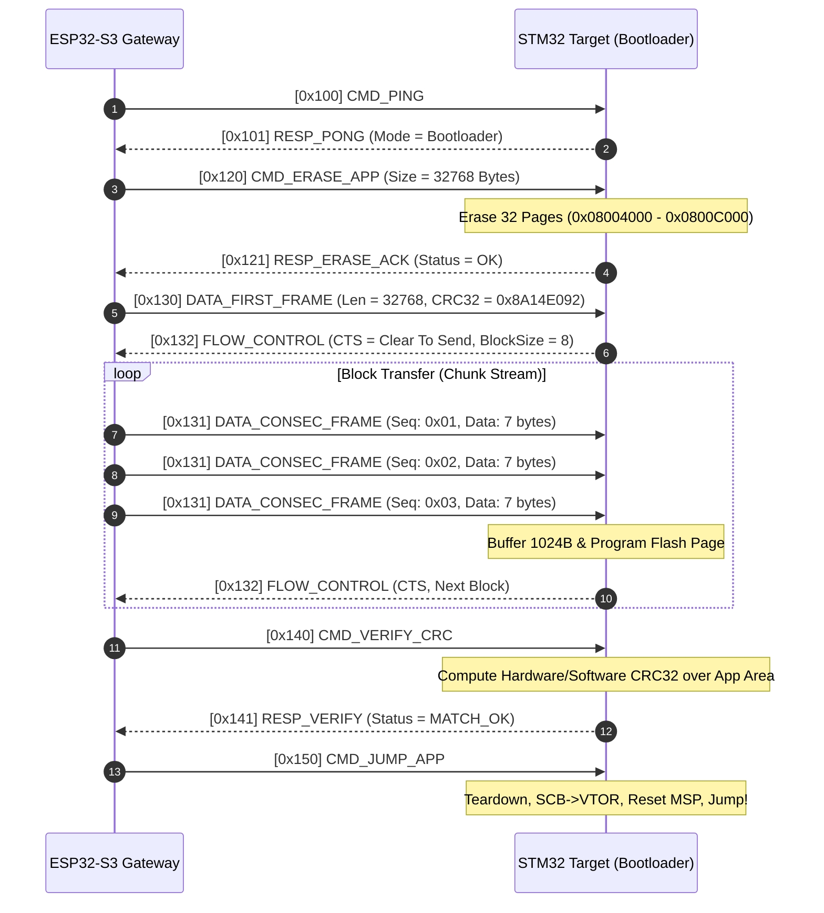

# STM32F103 CAN Bootloader & ESP32-S3 Gateway

[-002B49?logo=stmicroelectronics)](https://www.st.com)
[-E7352C?logo=espressif)](https://www.espressif.com)
[](https://en.wikipedia.org/wiki/CAN_bus)
[](https://en.wikipedia.org/wiki/C_(programming_language))
[](LICENSE)

A robust, production-grade custom CAN Bootloader for **STM32F103C8T6** (ARM Cortex-M3) paired with an **ESP32-S3 Wireless/USB Gateway**. This project enables secure, fail-safe In-System Programming (ISP) and In-Application Programming (IAP) over a 2-wire differential CAN Bus (bxCAN <-> TWAI) at 500 kbps, eliminating the need for dedicated SWD/JTAG debuggers during field updates.

---

## Table of Contents
- [1. System Architecture](#1-system-architecture)
- [2. Key Features](#2-key-features)
- [3. Hardware Specifications & Pinout](#3-hardware-specifications--pinout)
- [4. Memory Map & Vector Table Management](#4-memory-map--vector-table-management)
- [5. CAN Communication & Flashing Protocol](#5-can-communication--flashing-protocol)
- [6. Fail-Safe & Anti-Bricking Mechanisms](#6-fail-safe--anti-bricking-mechanisms)
- [7. Directory Structure](#7-directory-structure)
- [8. Getting Started & Build Guide](#8-getting-started--build-guide)
- [9. Testing & Verification](#9-testing--verification)
- [10. Roadmap](#10-roadmap)
- [11. License & References](#11-license--references)

---

## 1. System Architecture

The system decouples the communication frontend from the real-time target MCU:
1. **Host PC / Web Client:** Transmits the compiled `.bin` / `.hex` binary via USB Serial or WiFi Web Interface.
2. **ESP32-S3 Gateway:** Parses firmware payload, handles protocol framing (fragmentation into CAN frames), manages flow control, and pushes packets across the CAN bus via TWAI (Two-Wire Automotive Interface).
3. **STM32F103 Target (Bootloader):** Receives multi-frame CAN packets, validates CRC32 / checksums, programs internal Flash pages (1 KB granularity), verifies programmed memory, and vectors execution to the User Application.

```
+------------------+         WiFi (HTTP/WebSockets)        +--------------------+
|  Host Machine    | ------------------------------------> |  ESP32-S3 Gateway  |
|  (PC / Web UI /  |         USB-CDC (VCP / CLI)           |  - TWAI Driver     |
|   Python Tool)   | <-----------------------------------> |  - LittleFS / Web  |
+------------------+                                       +--------------------+
                                                                     |
                                                              [ CAN-TX / CAN-RX ]
                                                                     |
                                                           +--------------------+
                                                           | 3.3V CAN Tx/Rx     |
                                                           | (SN65HVD230/TJA1050|
                                                           +--------------------+
                                                                     |
                                                   =====================================
                                                   CAN Bus (CAN_H / CAN_L) (120 Ohm Term)
                                                   =====================================
                                                                     |
                                                           +--------------------+
                                                           | 3.3V/5V CAN Transc |
                                                           +--------------------+
                                                                     |
                                                              [ CAN-TX / CAN-RX ]
                                                                     |
                                                           +--------------------+
                                                           | STM32F103 (Target) |
                                                           | - bxCAN Peripheral |
                                                           | - Flash Controller |
                                                           | - VTOR Relocator   |
                                                           +--------------------+
```

---

## 2. Key Features

- **High-Speed Bus Reliability:** Configured for CAN 2.0B Standard 11-bit identifier framing at **500 kbps** (configurable to 250 kbps or 1 Mbps).
- **ISO-TP Inspired Multi-Frame Protocol:** Overcomes the standard 8-byte CAN payload limitation with chunking:
  - *Single Frame (SF)* for commands and control signals.
  - *First Frame (FF)* declaring payload length and metadata.
  - *Consecutive Frame (CF)* streaming binary chunks with sequence counters.
  - *Flow Control (FC)* preventing buffer overflow on the target MCU.
- **Hardware-Level Vector Table Relocation:** Clean separation between Bootloader (0x08000000) and User Application (0x08004000) with dynamic `SCB->VTOR` remap and Stack Pointer validation before jumping.
- **Robust Integrity Checking:** CRC32 calculation over raw binary streams + Page-by-Page Flash verification against written memory buffers.
- **Fail-Safe & Anti-Brick Boot Sequence:**
  - Application Header validation (checks initial MSP points to valid SRAM range `0x20000000 - 0x20005000` and Reset Handler points to Flash range `0x08004000 - 0x08010000`).
  - Emergency Boot Pin: Force stay in Bootloader mode if user button is held low during reset.
  - Interrupted flash recovery: If power drops mid-write, the bootloader stays active awaiting re-transmission.
- **Dual Flash Storage / Chunk Buffering:** Page erase executed strictly on target page boundaries (1024 bytes) to maximize flash endurance and minimize write cycle stalls.

---

## 3. Hardware Specifications & Pinout

### 3.1 Components
| Item | Part / Model | Quantity | Notes |
|---|---|---|---|
| Target MCU | STM32F103C8T6 (Blue Pill) | 1 | 64 KB Flash, 20 KB SRAM, Cortex-M3 @ 72 MHz |
| Gateway MCU | ESP32-S3-DevKitC-1 | 1 | Dual-core Xtensa LX7 @ 240 MHz, TWAI, WiFi/BLE |
| CAN Transceiver | SN65HVD230 / TJA1050 | 2 | 3.3V logic compatible (SN65HVD230 recommended for direct 3.3V logic) |
| Bus Termination | 120 $\Omega$ Resistor | 2 | Placed across `CAN_H` and `CAN_L` at both bus termination ends |
| Programmer | ST-Link V2 | 1 | Used initially to flash the bootloader |

### 3.2 Interconnection & Wiring

#### STM32F103 <-> CAN Transceiver (Node 1 - Target)
| STM32 Pin | Transceiver Pin | Function / Description |
|---|---|---|
| **PA11** (or PB8 if remapped) | `CTX` / `TXD` | bxCAN Receive / Transmit lines |
| **PA12** (or PB9 if remapped) | `CRX` / `RXD` | |
| **3.3V / 5V** | `VCC` | Power (3.3V for SN65HVD230, 5V for TJA1050) |
| **GND** | `GND` | Common Ground |
| **PA0** | Button / Pull-up | Force Bootloader Mode Trigger (Active Low) |
| **PC13** | On-board LED | Bootloader Status Indicator |

#### ESP32-S3 <-> CAN Transceiver (Node 2 - Gateway)
| ESP32-S3 GPIO | Transceiver Pin | Function / Description |
|---|---|---|
| **GPIO 4** (Configurable) | `TXD` | TWAI Controller TX |
| **GPIO 5** (Configurable) | `RXD` | TWAI Controller RX |
| **3.3V** | `VCC` | Power |
| **GND** | `GND` | Common Ground |

#### Differential Bus Line
```
[Node 1 CAN Transceiver]                                      [Node 2 CAN Transceiver]
     CAN_H ---------------------+---------------------------------- CAN_H
                                |
                             [120 Ohm]                          [120 Ohm]
                                |                                  |
     CAN_L ---------------------+---------------------------------- CAN_L
```

---

## 4. Memory Map & Vector Table Management

The STM32F103C8T6 internal Flash is partitioned into two distinct sectors:

```
0x08000000 +-----------------------------------------------+
           |                                               |
           |      Bootloader Firmware (16 KB)              |
           |      - bxCAN Driver                           |
           |      - Flash Page Writer / Eraser             |
           |      - Protocol Parser & CRC32 Engine         |
           |                                               |
0x08004000 +-----------------------------------------------+ <--- Application Base Address
           |      App Vector Table (0x08004000)            |      (SCB->VTOR = 0x08004000)
           |      - Word 0: Initial Main Stack Pointer     |
           |      - Word 1: Reset Handler Address          |
           |      - Words 2-N: ISR Vectors                 |
           +-----------------------------------------------+
           |                                               |
           |      User Application Firmware (48 KB)        |
           |                                               |
0x08010000 +-----------------------------------------------+ <--- End of Flash (64 KB)
```

### Jump to Application Routine Sequence
Before transferring execution to the user application, the bootloader performs an atomic teardown:
1. **Disable all interrupts:** `__disable_irq();`
2. **De-initialize peripherals:** Reset bxCAN, SysTick Timer, and GPIOs back to default reset states.
3. **Verify Valid Application:**
   ```c
   uint32_t app_msp = *(__IO uint32_t*)APP_START_ADDRESS;
   // Check if Stack Pointer falls within 20KB SRAM (0x20000000 to 0x20005000)
   if ((app_msp & 0x2FFE0000) == 0x20000000) {
       uint32_t app_reset_handler = *(__IO uint32_t*)(APP_START_ADDRESS + 4);
       pFunction app_entry = (pFunction)app_reset_handler;
       
       // Relocate Vector Table Offset Register
       SCB->VTOR = APP_START_ADDRESS;
       
       // Initialize Main Stack Pointer
       __set_MSP(app_msp);
       
       // Enable interrupts and jump
       __enable_irq();
       app_entry();
   }
   ```

---

## 5. CAN Communication & Flashing Protocol

The protocol utilizes standardized 11-bit CAN identifiers categorized into Service Request / Response pairs.

### 5.1 CAN ID Allocation

| CAN ID (Hex) | Name | Direction | Description |
|---|---|---|---|
| `0x100` | `CMD_PING` | Gateway -> STM32 | Ping target MCU to check presence |
| `0x101` | `RESP_PONG` | STM32 -> Gateway | Target responds with status (Boot/App mode) |
| `0x110` | `CMD_ENTER_BOOT` | Gateway -> STM32 | Request MCU to enter Bootloader mode |
| `0x111` | `RESP_BOOT_ACK` | STM32 -> Gateway | Acknowledge bootloader entry readiness |
| `0x120` | `CMD_ERASE_APP` | Gateway -> STM32 | Request mass/page erase of app partition |
| `0x121` | `RESP_ERASE_ACK`| STM32 -> Gateway | Erase status response (Success/Fail/Busy) |
| `0x130` | `DATA_FIRST_FRAME` | Gateway -> STM32 | Total image size (4B) + Target CRC32 (4B) |
| `0x131` | `DATA_CONSEC_FRAME`| Gateway -> STM32 | Sequence Index (1B) + Binary payload (up to 7B) |
| `0x132` | `FLOW_CONTROL` | STM32 -> Gateway | CTS (Continue To Send), Wait, or Abort |
| `0x140` | `CMD_VERIFY_CRC`| Gateway -> STM32 | Final validation trigger |
| `0x141` | `RESP_VERIFY` | STM32 -> Gateway | Validation result (Passed / Checksum error) |
| `0x150` | `CMD_JUMP_APP` | Gateway -> STM32 | Command target to branch to Application |

### 5.2 Flash Update Sequence Flow



---

## 6. Fail-Safe & Anti-Bricking Mechanisms

1. **Power Loss Immunity:** Flash writes are committed page-by-page. If power drops mid-transfer, the Bootloader remains permanently in 0x08000000. On restart, the invalid application header prevents erratic execution and holds in boot mode.
2. **Double Integrity Validation:**
   - Transport Level: Sequence numbering detects dropped CAN frames.
   - Storage Level: Full hardware CRC32 computed across the newly written image before setting the valid application flag.
3. **Emergency Manual Override:** If the user application contains critical bugs or hangs, grounding `PA0` during reset forces the bootloader to stay active and ignore the existing application.
4. **Timeout Watchdog:** If packet transmission stalls for longer than 3000 ms during an active update session, the bootloader cancels the session and re-enters the standby listening state.

---

## 7. Directory Structure

```
stm32-can-bootloader/
├── README.md                          # Project overview & documentation
├── docs/                              # Detailed specifications & schematics
│   ├── protocol_spec.md               # Bit-level CAN Protocol framing specification
│   ├── hardware_schematic.png         # Wiring diagrams & breadboard layouts
│   └── memory_layout.md               # Flash sector & linker configuration details
├── bootloader/                        # STM32 Bootloader Firmware (Target)
│   ├── Core/
│   │   ├── Inc/
│   │   │   ├── bootloader.h           # Jump, Flash & Protocol headers
│   │   │   ├── can_driver.h           # bxCAN initialization & filter config
│   │   │   └── crc32.h                # CRC32 validation routines
│   │   └── Src/
│   │       ├── bootloader.c           # State machine, Flash write/erase
│   │       ├── can_driver.c           # CAN message dispatching
│   │       ├── crc32.c                # Hardware/Software CRC calculation
│   │       └── main.c                 # Bootloader entry point & boot pin check
│   ├── STM32F103C8Tx_FLASH_BOOT.ld    # Linker script (16KB Flash allocation)
│   └── Makefile / CMakeLists.txt      # Build configuration
├── application/                       # STM32 Demo User Application (Target)
│   ├── Core/
│   │   └── Src/
│   │       └── main.c                 # Application logic (Blink LED / CAN echo)
│   ├── STM32F103C8Tx_FLASH_APP.ld     # Linker script (Offset 0x08004000, 48KB)
│   └── Makefile / CMakeLists.txt      # Build configuration
├── gateway_esp32/                     # ESP32-S3 Gateway Firmware
│   ├── main/
│   │   ├── twai_can_master.c          # ESP32 TWAI driver & framing engine
│   │   ├── wifi_ota_server.c          # Web server for browser-based .bin upload
│   │   └── main.c                     # Gateway controller entry
│   └── CMakeLists.txt                 # ESP-IDF build system
└── tools/                             # Host Deployment & Test Utilities
    ├── can_uploader.py                # Python serial/CAN direct flashing script
    ├── bin_checksum_patcher.py        # Pre-process binary, inject CRC32 header
    └── requirements.txt               # Python dependencies (pyserial, python-can)
```

---

## 8. Getting Started & Build Guide

### 8.1 Prerequisites
- **ARM GCC Toolchain:** `arm-none-eabi-gcc` (v10+), `make` or `ninja`, `openocd` or `stlink-tools`.
- **ESP32-S3 Toolchain:** [ESP-IDF v5.x](https://docs.espressif.com/projects/esp-idf/en/latest/esp32s3/) or PlatformIO.
- **Python Environment:** Python 3.9+ with `python-can`, `pyserial`.

### 8.2 Building the STM32 Bootloader
```bash
cd bootloader
# Compile the bootloader elf & bin
make -j4
# Flash bootloader once via ST-Link
st-flash write build/bootloader.bin 0x08000000
```

### 8.3 Building the STM32 User Application
```bash
cd application
# Compile user app configured with 0x08004000 offset
make -j4
# Output: build/application.bin
```

### 8.4 Building the ESP32-S3 Gateway
```bash
cd gateway_esp32
idf.py set-target esp32s3
idf.py build
idf.py -p /dev/ttyACM0 flash monitor
```

---

## 9. Testing & Verification

1. **CAN Bus Loopback & Impedance Test:**
   - Measure resistance between `CAN_H` and `CAN_L` when powered down. The multimeter must show **$\approx 60\ \Omega$** (two $120\ \Omega$ resistors in parallel).
2. **Flash Update via Python CLI:**
   ```bash
   python3 tools/can_uploader.py \
       --port /dev/ttyUSB0 \
       --baudrate 115200 \
       --file application/build/application.bin \
       --target-id 0x100
   ```
3. **OTA Flash Update via Web Interface:**
   - Connect to ESP32 Access Point: `STM32-CAN-Gateway`
   - Navigate to `http://192.168.4.1`
   - Choose `application.bin` and click **Flash Target**. Monitor live progress bar on Web UI.

---

## 10. Roadmap

- [x] Initial Architecture & Memory Map Design
- [ ] G0: Hardware verification (Loopback bxCAN & TWAI)
- [ ] G1: Minimal UART-based Bootloader baseline with Flash/Jump logic
- [ ] G2: bxCAN & TWAI 500 kbps transport configuration
- [ ] G3: Protocol implementation (Multi-frame ISO-TP chunking)
- [ ] G4: Full end-to-end CAN flash integration
- [ ] G5: Hardening against sudden power loss & CRC faults
- [ ] G6: Web UI OTA Dashboard on ESP32-S3 & SSD1306 OLED Status Display

---

## 11. License & References

- **License:** Distributed under the MIT License. See `LICENSE` for more information.
- **References:**
  - STM32F103xC/D/E Reference Manual (*RM0008*) — bxCAN & Flash Memory Controller.
  - ST AN2606: *STM32 microcontroller system memory boot mode*.
  - Espressif TWAI (Two-Wire Automotive Interface) Guide.
  - ISO 15765-2 (ISO-TP Road Vehicles Diagnostic Communication).
