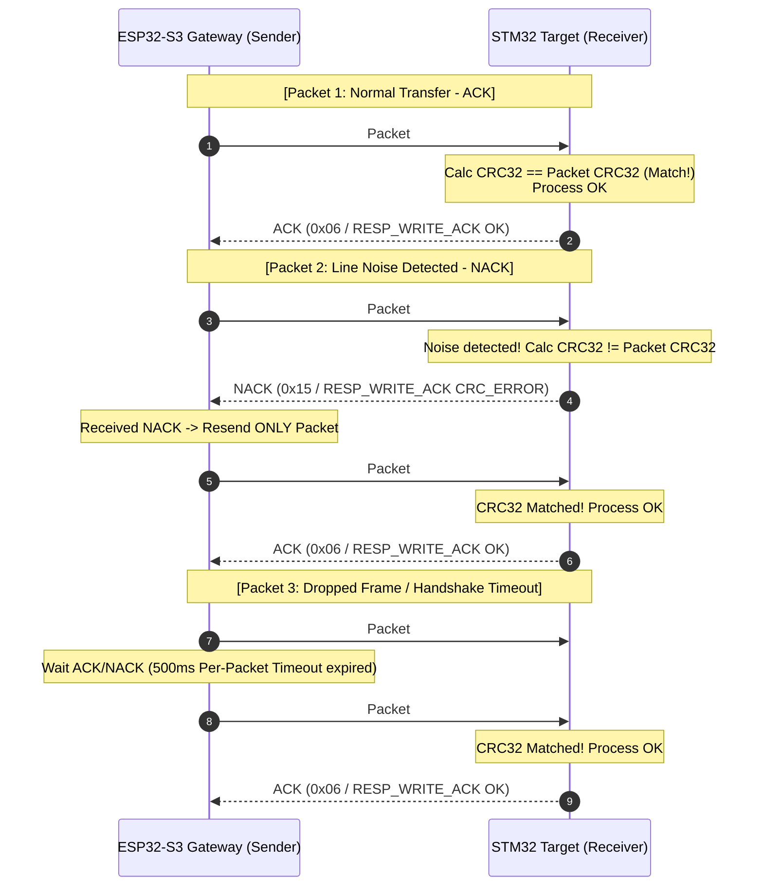

# STM32 UART Bootloader & ESP32-S3 Wireless Gateway

[-002B49?logo=stmicroelectronics)](https://www.st.com)
[-E7352C?logo=espressif)](https://www.espressif.com)
[](https://en.wikipedia.org/wiki/Universal_asynchronous_receiver-transmitter)
[](https://en.wikipedia.org/wiki/C_(programming_language))
[](LICENSE)

A robust, production-grade custom **UART Bootloader** for **STM32F103C8T6** (ARM Cortex-M3) paired with an **ESP32-S3 Wireless Gateway**. This project enables reliable In-Application Programming (IAP) and Over-The-Air (OTA) firmware updates over a full-duplex UART interface (115200 - 921600 bps), eliminating the need for dedicated ST-Link/JTAG debuggers during field maintenance.

---

## Table of Contents
- [1. System Architecture](#1-system-architecture)
- [2. Key Features](#2-key-features)
- [3. Hardware Specifications & Pinout](#3-hardware-specifications--pinout)
- [4. Memory Map & Vector Table Relocation](#4-memory-map--vector-table-relocation)
- [5. UART Communication & Flashing Protocol (Packet CRC32 + ACK/NACK)](#5-uart-communication--flashing-protocol-packet-crc32--acknack)
  - [5.1 Protocol Design Rationale: Raw vs. Protected Framing](#51-protocol-design-rationale-raw-transmission-vs-protected-framing)
  - [5.2 Packet Structure & Framing Format](#52-packet-structure--framing-format)
  - [5.3 Transmission Flow & ACK/NACK Auto-Retry Mechanism](#53-transmission-flow--acknack-auto-retry-mechanism)
  - [5.4 Command Set](#54-command-set)
  - [5.5 Engineering Highlights & Interview Value](#55-engineering-highlights--interview-value)
- [6. Fail-Safe & Anti-Bricking Mechanisms](#6-fail-safe--anti-bricking-mechanisms)
  - [6.1 Fail-Safe Rollback & 2-Pass Pre-Verification (Option B)](#61-fail-safe-rollback--2-pass-pre-verification-flow-option-b)
  - [6.2 Additional Safety Guards](#62-additional-safety-guards)
- [7. Directory Structure](#7-directory-structure)
- [8. Getting Started & Build Guide](#8-getting-started--build-guide)
- [9. Testing & Verification](#9-testing--verification)
- [10. Roadmap](#10-roadmap)
- [11. License & References](#11-license--references)

---

## 1. System Architecture

The system decouples network communication and target execution:
1. **Host PC / Web Client:** Transmits the compiled `.bin` / `.hex` binary via Web UI, MQTT/HTTP OTA, or Python CLI.
2. **ESP32-S3 Gateway:** Receives binary stream over Wi-Fi / BLE / USB-CDC, caches the image in SPIFFS/LittleFS, chunks the payload into verified UART packets, manages flow control, and drives STM32 reset/boot pins.
3. **STM32F103 Target (Bootloader):** Receives structured UART frames, validates 32-bit hardware CRC checks, commits Flash pages (1 KB granularity), verifies programmed memory, and jumps execution to the User Application.

```
+------------------+         WiFi (HTTP / WebSockets / OTA)     +--------------------+
|  Host Machine    | -----------------------------------------> |  ESP32-S3 Gateway  |
|  (PC / Web UI /  |         USB-CDC / Serial CLI               |  - Web OTA Server  |
|   Python Tool)   | <----------------------------------------> |  - SPIFFS Cache    |
+------------------+                                            |  - UART Packetizer |
                                                                +--------------------+
                                                                           |
                                                             [ Direct 3.3V UART (TX/RX) ]
                                                             [ NRST (Open-Drain) / BOOT0]
                                                                           |
                                                                +--------------------+
                                                                | STM32F103 (Target) |
                                                                | - USART Peripheral |
                                                                | - Hardware CRC32   |
                                                                | - Flash Controller |
                                                                | - VTOR Relocator   |
                                                                +--------------------+
```

---

## 2. Key Features

- **High-Speed & Simple Wiring:** Operates directly over standard 3.3V UART logic levels (115200 to 921600 bps) with just 2 communication wires (`TX`/`RX`) + `GND`.
- **Packet-Based Frame Protocol:**
  - Robust framing with Header (`0xAA 0x55`), Packet Type, Length, Payload, and **4-byte CRC32**.
  - Chunked binary transfer with configurable buffer size (128B, 256B, 512B) for high throughput.
  - Strict ACK / NACK and flow control handshake with automatic retry (up to 3 attempts) on CRC mismatch or timeout.
- **Hardware-Level Vector Table Relocation:** Clean separation between Bootloader (`0x08000000`), Metadata sector (`0x08004000`), and User Application (`0x08004400`) with dynamic `SCB->VTOR` remap and Main Stack Pointer (MSP) integrity verification prior to branching.
- **Unified Hardware CRC32 Engine:** Utilizes STM32's native hardware CRC unit (`CRC->DR`, IEEE 802.3 polynomial `0x04C11DB7`) for both frame verification and incremental running CRC calculation.
- **Fail-Safe 2-Pass Boot Sequence:**
  - Pass 1: Stream pre-verification with incremental hardware CRC32 (zero flash write until 100% verified).
  - Pass 2: Atomic flash write with `IN_PROGRESS` metadata flag protection against power drops.
  - Emergency Boot Pin: Force bootloader mode if user button / jumper (`PA0`) is held low during reset.
- **Hardware Flow & Reset Control:** ESP32-S3 controls STM32 `NRST` via Open-Drain mode to automate entering boot mode or system recovery without electrical contention.

---

## 3. Hardware Specifications & Pinout

### 3.1 Components
| Item | Part / Model | Quantity | Notes |
|---|---|---|---|
| Target MCU | STM32F103C8T6 (Blue Pill) | 1 | 64 KB Flash, 20 KB SRAM, Cortex-M3 @ 72 MHz |
| Gateway MCU | ESP32-S3 (DevKit / Module) | 1 | Dual-core Xtensa LX7 @ 240 MHz, 2.4 GHz Wi-Fi + BLE 5.0, 512 KB SRAM |
| Programmer | ST-Link V2 | 1 | Used once to flash the initial bootloader |
| Interconnect | Jumper wires | - | Female-to-Female / Breadboard |

### 3.2 Interconnection & Wiring

#### STM32F103 <-> ESP32-S3 Direct Connection
| STM32 Pin | ESP32-S3 GPIO | Mode / Function | Description |
|---|---|---|---|
| **PA9 (USART1_TX)** | **GPIO 18 (UART_RX)** | Input | STM32 Transmit $\rightarrow$ ESP32-S3 Receive |
| **PA10 (USART1_RX)**| **GPIO 17 (UART_TX)** | Output | STM32 Receive $\leftarrow$ ESP32-S3 Transmit |
| **3.3V** | **3.3V** | Power | Logic Level / Power Supply |
| **GND** | **GND** | Ground | Common Ground (Mandatory) |
| **NRST** *(Optional)* | **GPIO 16** | Open-Drain Out | ESP32-S3 controlled Active-Low Hardware Reset |
| **PA0 / BOOT0** *(Opt)* | **GPIO 15** | Push-Pull Out | ESP32-S3 controlled Force Bootloader Mode |
| **PC13** | - | Output | On-board LED (Status Indicator) |

> [!IMPORTANT]
> - Both STM32 and ESP32-S3 operate at **3.3V logic levels**.
> - The ESP32-S3 must drive the STM32 `NRST` pin in **Open-Drain mode** (pulled low to assert reset, floating / High-Z to release) to avoid conflicting with the STM32 internal pull-up resistor (~40 kΩ) and reset capacitor.

---

## 4. Memory Map & Vector Table Relocation

The STM32F103C8T6 internal 64 KB Flash memory (64 pages $\times$ 1 KB) is partitioned into three dedicated regions:

```
0x08000000 +-----------------------------------------------+
           |                                               |
           |      Bootloader Firmware (16 KB - Pages 0..15)|
           |      - USART Driver & Ring Buffer             |
           |      - Flash Page Writer / Eraser             |
           |      - Hardware CRC32 Parser & State Machine  |
           |                                               |
0x08004000 +-----------------------------------------------+ <--- Metadata Sector (Page 16, 1 KB)
           |      Metadata & Boot Flags (1 KB)             |
           |      - Byte 0x00: Flash State (IN_PROGRESS)   |
           |      - Bytes 0x04..0x07: Firmware Size        |
           |      - Bytes 0x08..0x0B: Expected CRC32       |
           |      - Bytes 0x0C..0x0F: Firmware Version     |
0x08004400 +-----------------------------------------------+ <--- Application Base Address (VTOR)
           |      App Vector Table (0x08004400)            |      (SCB->VTOR = 0x08004400)
           |      - Word 0: Initial Main Stack Pointer     |
           |      - Word 1: Reset Handler Address          |
           |      - Words 2-N: ISR Vectors                 |
           +-----------------------------------------------+
           |                                               |
           |      User Application Firmware (47 KB)        |
           |      (Pages 17..63)                           |
           |                                               |
0x08010000 +-----------------------------------------------+ <--- End of Flash (64 KB)
```

### Jump to Application Routine Sequence
Before transferring execution to the user application, the bootloader performs an atomic teardown:
1. **Disable all interrupts:** `__disable_irq();`
2. **De-initialize peripherals:** Reset USART, SysTick Timer, and GPIOs back to default reset states.
3. **Verify Valid Application:**
   ```c
   #define APP_START_ADDRESS  0x08004400
   
   uint32_t app_msp = *(__IO uint32_t*)APP_START_ADDRESS;
   // Check if Stack Pointer falls within 20KB SRAM (0x20000000 to 0x20005000)
   if ((app_msp & 0x2FFE0000) == 0x20000000) {
       uint32_t app_reset_handler = *(__IO uint32_t*)(APP_START_ADDRESS + 4);
       pFunction app_entry = (pFunction)app_reset_handler;
       
       // Relocate Vector Table Offset Register
       SCB->VTOR = APP_START_ADDRESS;
       
       // Initialize Main Stack Pointer
       __set_MSP(app_msp);
       
       // Enable interrupts and jump
       __enable_irq();
       app_entry();
   }
   ```

---

## 5. UART Communication & Flashing Protocol (Packet CRC32 + ACK/NACK)

### 5.1 Protocol Design Rationale: Raw Transmission vs. Protected Framing

#### The Problem with Naive Raw Transmission (No Protection)
In basic UART bootloader implementations, streaming raw `.bin` bytes directly ("read byte, write byte") introduces critical reliability issues:
1. **EMI / Electrical Noise:** UART lines are susceptible to electrical interference, causing dropped or flipped bytes $\rightarrow$ STM32 silently writes corrupt data to Flash, bricking the device on boot.
2. **Zero Feedback:** The transmitter (ESP32-S3/PC) cannot verify whether the STM32 received all bytes correctly or suffered buffer overrun.
3. **No Granular Recovery:** If transmission fails midway, the system cannot identify where the fault occurred, forcing a complete restart from byte 0.

#### Industry Standard Solution — Framed Packets with Protection
Instead of streaming an entire binary at once, firmware is split into small packets (e.g., **256 bytes / packet**), each protected by a structured frame:

```
[START_BYTE] [Packet_ID / CMD] [Length] [Data Payload...] [CRC32] [END_BYTE]
```

---

### 5.2 Packet Structure & Framing Format

```
+---------------+---------------+---------------+---------------+---------------+---------------+
| Header (2B)   | Command / ID  | Length (2B)   | Payload (N B) | CRC32 (4B)    | Tail (1B)     |
| 0xAA 0x55     | CMD_TYPE / ID | Big-Endian    | Data bytes    | IEEE 802.3    | 0x0D          |
+---------------+---------------+---------------+---------------+---------------+---------------+
```

- **Header (`0xAA 0x55` / `START_BYTE`):** 2 synchronization bytes identifying frame start.
- **Packet_ID / Command (`1 Byte`):** Operation command code (e.g. `0x03` = `CMD_WRITE_DATA`).
- **Length (`2 Bytes`, Big-Endian):** Size of the payload field ($0 \le N \le 1024$ bytes, default 256B/packet).
- **Payload (`N Bytes`):** Target Flash memory offset (4B) + raw binary chunk.
- **CRC32 Checksum (`4 Bytes`, Big-Endian):** IEEE 802.3 CRC-32 (polynomial `0x04C11DB7`) computed over `[Command + Length + Payload]`. Directly verified by the STM32 hardware CRC engine.
- **Tail (`0x0D` / `END_BYTE`):** Frame delimiter (`\r`).

> [!NOTE]
> All checksum calculations standardize on **CRC-32 (polynomial `0x04C11DB7`)** to leverage STM32's internal hardware CRC peripheral (`CRC->DR`), avoiding software calculation overhead.

---

### 5.3 Transmission Flow & ACK/NACK Auto-Retry Mechanism

Communication between ESP32-S3 (Sender) and STM32 (Receiver) follows a strict synchronous handshake:

1. **ESP32-S3 transmits Packet $N$:** Chunks 256 bytes with 4-byte CRC32.
2. **STM32 validates packet:** Computes CRC32 over received payload and compares with the frame's CRC32 field.
3. **Case 1 — CRC Match (Integrity OK):**
   - STM32 commits data / accumulates running CRC.
   - STM32 replies with **`ACK`** (`0x06` / `RESP_WRITE_ACK 0x00`).
   - ESP32-S3 proceeds to transmit Packet $N+1$.
4. **Case 2 — CRC Mismatch (Noise Detected):**
   - STM32 discards the packet (no flash write / no running CRC corruption).
   - STM32 replies with **`NACK`** (`0x15` / `RESP_WRITE_ACK 0x01`).
   - ESP32-S3 **retransmits only Packet $N$** (no full restart needed).
5. **Case 3 — Lost Packet / Per-Packet Timeout:**
   - If ESP32-S3 receives no `ACK`/`NACK` within **500 ms (Per-Packet Timeout)**, it automatically retransmits Packet $N$.
   - Retries up to **3 times** before aborting and reporting an unrecoverable link error.

#### Sequence Flow Diagram



---

### 5.4 Command Set

| Command Code | Name | Direction | Description |
|---|---|---|---|
| `0x00` | `CMD_START_UPDATE` | ESP32-S3 $\rightarrow$ STM32 | Send `Total Firmware Size [4B]` + `Total Expected CRC32 [4B]` to initialize update session |
| `0x80` | `RESP_START_ACK` | STM32 $\rightarrow$ ESP32-S3 | Target acknowledges session init & signals readiness for Pass 1 pre-verification |
| `0x01` | `CMD_PING` | ESP32-S3 $\rightarrow$ STM32 | Query target MCU status & active mode (Bootloader / App) |
| `0x81` | `RESP_PONG` | STM32 $\rightarrow$ ESP32-S3 | Target responds with status & bootloader version |
| `0x02` | `CMD_ERASE` | ESP32-S3 $\rightarrow$ STM32 | Request erase of application flash pages (`0x08004400`..`0x08010000`) |
| `0x82` | `RESP_ERASE` | STM32 $\rightarrow$ ESP32-S3 | Flash erase result (Success / Error) |
| `0x03` | `CMD_WRITE_DATA` | ESP32-S3 $\rightarrow$ STM32 | Binary chunk (`Flash Offset [4B]` + `Length [2B]` + `Chunk Data [NB]`) |
| `0x83` | `RESP_WRITE_ACK` | STM32 $\rightarrow$ ESP32-S3 | Chunk write acknowledgment (`0x00`: ACK, `0x01`: NACK CRC, `0x02`: Flash Error) |
| `0x04` | `CMD_VERIFY_CRC` | ESP32-S3 $\rightarrow$ STM32 | Trigger full hardware CRC32 readback verification on programmed Flash |
| `0x84` | `RESP_VERIFY` | STM32 $\rightarrow$ ESP32-S3 | Image verification result (`0x00`: MATCH_OK, `0x01`: MISMATCH) |
| `0x05` | `CMD_JUMP_APP` | ESP32-S3 $\rightarrow$ STM32 | Command bootloader to branch to Application (`0x08004400`) |

---

### 5.5 Engineering Highlights & Interview Value

- **Industry Protocol Parallels:** Implements the same core principles found in proven industrial standards (packetization and ACK handshakes in **TCP**, hardware CRC error detection in **Modbus RTU/CAN**, and block-by-block retransmission in **Xmodem / Ymodem**).
- **Bare-Metal Mastery:** Building the framing parser, state machine, hardware CRC32 verification, and retry logic from scratch demonstrates low-level transport layer competence without relying on third-party black-box libraries.
- **Key Interview Takeaway:** Concrete answer to the classic embedded interview question: *"How do you guarantee firmware integrity and recover from transmission errors over a noisy serial interface?"*

---

## 6. Fail-Safe & Anti-Bricking Mechanisms

Designed specifically for resource-constrained microcontrollers (STM32F103 has 20KB RAM, insufficient to buffer an entire 40–47KB firmware image):

### 6.1 Fail-Safe Rollback & 2-Pass Pre-Verification Flow (Option B)

Due to STM32F103's limited 20 KB SRAM, buffering an entire 40–47 KB application image in memory is impossible. To prevent bricking without requiring external RAM, the bootloader implements a **Two-Pass Flashing Strategy**:

```
[Phase 1: Pre-Verify]  ESP32-S3 stream file (SPIFFS) ──> STM32 Hardware Running CRC32 ──> Matches Total CRC32
                                                                                               │ (Set Ready Flag)
                                                                                               ▼
[Phase 2: Safe Write]  Set Flag "IN_PROGRESS" ──> Erase Flash ──> Write Data ──> Verify OK ──> Clear Flag
                                                        │ (Power Loss Interruption)
                                                        ▼
[Recovery on Reboot]   Bootloader detects "IN_PROGRESS" Flag ──> App Corrupt ──> Blink LED / Wait Reflash
```

1. **Session Initialization (`CMD_START_UPDATE`):**
   - ESP32-S3 transmits Header (`Total Size` + `Total Expected CRC32`). STM32 initializes its hardware CRC peripheral and caches parameters in RAM.
2. **Pass 1 — Streaming Pre-Verification via Running CRC32:**
   - **Why Pass 1 is necessary:** The system verifies the integrity of the *entire* incoming image before modifying any internal Flash memory.
   - ESP32-S3 streams binary chunks (128B / 256B) over UART.
   - For each packet received, STM32 validates frame-level CRC32 and sequentially feeds the payload bytes into the **STM32 Hardware CRC32 Unit** (`CRC->DR`), accumulating a continuous running CRC32. **No flash pages are erased or written during Pass 1.**
   - Once all packets arrive, STM32 compares the accumulated hardware CRC32 with the expected Total CRC32. If matched $\rightarrow$ STM32 responds with `RESP_START_ACK (READY_TO_WRITE)`.
3. **Pass 2 — Atomic Flash Write with Metadata State Tracking:**
   - ESP32-S3 re-streams the binary chunks directly from its local SPIFFS/LittleFS cache (**no user re-upload needed**).
   - Before erasing Flash, STM32 writes an `IN_PROGRESS` (`0x55`) state byte to the dedicated **Metadata Sector** (`0x08004000`).
   - STM32 erases application pages (`0x08004400`..`0x08010000`) and writes each verified chunk into Flash.
   - After all chunks are written, STM32 performs a full readback hardware CRC32 check across the newly flashed application region. Upon match $\rightarrow$ STM32 clears the state flag to `COMPLETED` (`0x00`).
4. **Automatic Power-Loss Recovery:**
   - If power drops mid-write during Pass 2 $\rightarrow$ On reboot, the Bootloader reads the Metadata sector and detects `FLAG == IN_PROGRESS`.
   - Bootloader knows the User Application is incomplete/corrupted $\rightarrow$ **Refuses to branch to App**, blinks `PC13` LED / transmits UART failure logs, and safely remains in Bootloader standby waiting for ESP32-S3 to reflash.

### 6.2 Additional Safety Guards
- **Stack Pointer (MSP) & Vector Table Check:** Validates that initial MSP points into valid 20 KB SRAM (`0x20000000 - 0x20005000`) and Reset Vector points into valid Flash (`0x08004400 - 0x08010000`) before jumping.
- **Emergency Hardware Boot Pin (`PA0`):** Pulling `PA0` low during reset forces bootloader execution regardless of flash state.
- **Dual-Level Timeout Guard:**
  - **Per-Packet Timeout (500 ms):** Triggered when an individual chunk ACK/NACK is lost; ESP32-S3 retries up to 3 times.
  - **Session Inactivity Timeout (5000 ms):** Triggered if communication stalls completely for 5 seconds; STM32 resets its internal state machine back to `IDLE` standby.

---

## 7. Directory Structure

```
stm32-bootloader/
├── README.md                          # Project overview & documentation
├── docs/                              # Detailed specifications & schematics
│   ├── protocol_spec.md               # UART protocol framing & packet format
│   ├── hardware_schematic.png         # Wiring diagrams & pinouts
│   └── memory_layout.md               # Flash sector & linker configuration details
├── bootloader/                        # STM32 Bootloader Firmware (Target)
│   ├── Core/
│   │   ├── Inc/
│   │   │   ├── bootloader.h           # Jump, Flash & Protocol headers
│   │   │   ├── uart_driver.h          # USART configuration & ring buffer
│   │   │   └── crc32.h                # Hardware/Software CRC calculation
│   │   └── Src/
│   │       ├── bootloader.c           # State machine, Flash write/erase
│   │       ├── uart_driver.c          # Non-blocking UART driver
│   │       ├── crc32.c                # CRC32 calculation routines
│   │       └── main.c                 # Bootloader entry point & boot pin check
│   ├── STM32F103C8Tx_FLASH_BOOT.ld    # Linker script (16KB Flash allocation)
│   └── Makefile / CMakeLists.txt      # Build configuration
├── application/                       # STM32 Demo User Application (Target)
│   ├── Core/
│   │   └── Src/
│   │       └── main.c                 # Application logic (Blink LED / UART echo)
│   ├── STM32F103C8Tx_FLASH_APP.ld     # Linker script (Offset 0x08004400, 47KB)
│   └── Makefile / CMakeLists.txt      # Build configuration
├── gateway_esp32/                     # ESP32-S3 Gateway Firmware
│   ├── main/
│   │   ├── uart_flasher.c             # ESP32-S3 UART master packetizer
│   │   ├── wifi_ota_server.c          # Web server for browser-based .bin upload
│   │   └── main.c                     # Gateway controller entry
│   └── CMakeLists.txt                 # ESP-IDF build system
└── tools/                             # Host Deployment & Test Utilities
    ├── uart_uploader.py               # Python CLI direct UART flashing script
    ├── bin_checksum_patcher.py        # Pre-process binary, inject CRC32 header
    └── requirements.txt               # Python dependencies (pyserial)
```

---

## 8. Getting Started & Build Guide

### 8.1 Prerequisites
- **ARM GCC Toolchain:** `arm-none-eabi-gcc` (v10+), `make` or `ninja`, `openocd` or `stlink-tools`.
- **ESP32 Toolchain:** [ESP-IDF v5.x](https://docs.espressif.com/projects/esp-idf/) or PlatformIO / Arduino IDE.
- **Python Environment:** Python 3.9+ with `pyserial`.

### 8.2 Building the STM32 Bootloader
```bash
cd bootloader
make -j4
# Flash bootloader once via ST-Link
st-flash write build/bootloader.bin 0x08000000
```

### 8.3 Building the STM32 User Application
```bash
cd application
make -j4
# Output: build/application.bin
```

### 8.4 Building the ESP32-S3 Gateway
```bash
cd gateway_esp32
idf.py set-target esp32s3
idf.py build
idf.py -p /dev/ttyUSB0 flash monitor
```

---

## 9. Testing & Verification

1. **Direct PC-to-STM32 UART Flashing (via USB-TTL converter):**
   ```bash
   python3 tools/uart_uploader.py \
       --port /dev/ttyUSB0 \
       --baudrate 115200 \
       --file application/build/application.bin
   ```
2. **OTA Flash Update via ESP32-S3 Web Interface:**
   - Connect to ESP32-S3 Wi-Fi AP: `STM32-UART-Gateway`
   - Navigate to `http://192.168.4.1`
   - Select `application.bin` and click **Flash Target**.
   - Monitor live upload progress and status on Web UI.

---

## 10. Roadmap

- [x] Initial Architecture & Memory Map Design
- [ ] G0: Hardware verification (Direct UART loopback & Pin verification)
- [ ] G1: Minimal UART-based Bootloader with Flash write & Jump logic
- [ ] G2: Packet framing protocol with CRC32 & ACK/NACK
- [ ] G3: Python flashing tool (`uart_uploader.py`)
- [ ] G4: ESP32-S3 Gateway firmware (Web OTA / SPIFFS Cache / Serial Forwarding)
- [ ] G5: Hardening against power drop & 2-Pass rollback protection
- [ ] G6: Web UI Dashboard on ESP32-S3 & OLED status display

---

## 11. License & References

- **License:** Distributed under the MIT License. See `LICENSE` for details.
- **References:**
  - STM32F103xC/D/E Reference Manual (*RM0008*) — Flash Memory Controller & USART.
  - ST AN2606: *STM32 microcontroller system memory boot mode*.
  - ST AN3155: *USART protocol used in the STM32 bootloader*.
