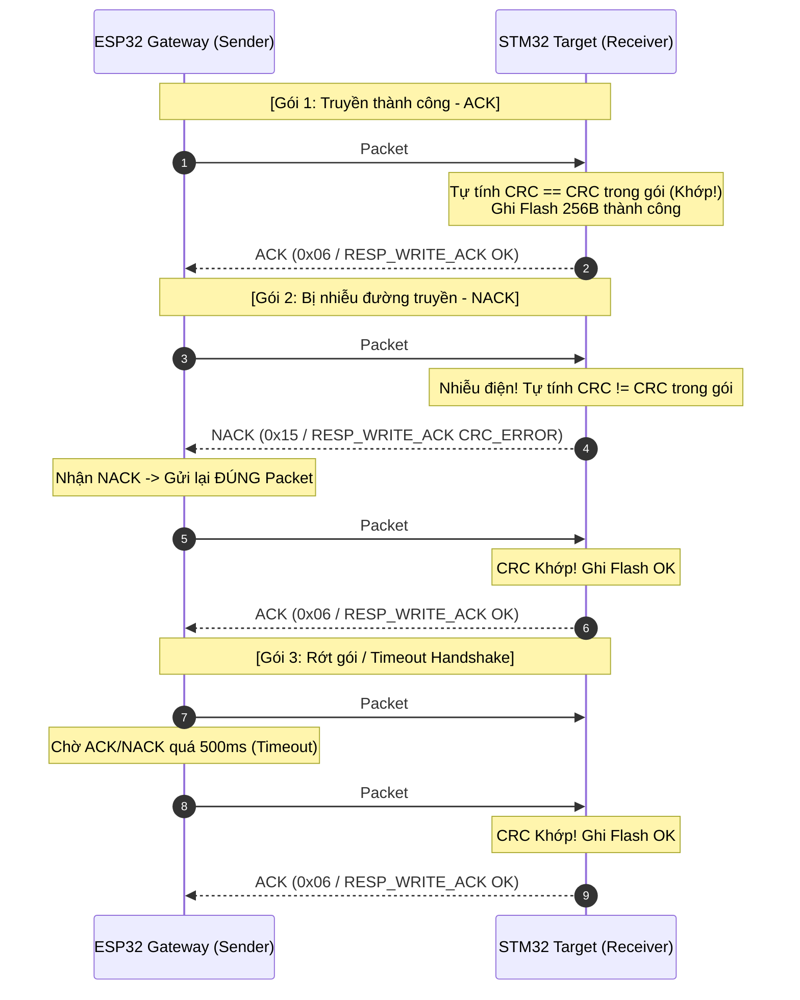

# STM32 UART Bootloader & ESP32 Wireless Gateway

[-002B49?logo=stmicroelectronics)](https://www.st.com)
[](https://www.espressif.com)
[](https://en.wikipedia.org/wiki/Universal_asynchronous_receiver-transmitter)
[](https://en.wikipedia.org/wiki/C_(programming_language))
[](LICENSE)

A robust, production-grade custom **UART Bootloader** for **STM32F103C8T6** (ARM Cortex-M3) paired with an **ESP32 Wireless Gateway**. This project enables reliable In-Application Programming (IAP) and Over-The-Air (OTA) firmware updates over a simple full-duplex UART interface (115200 - 921600 bps), eliminating the need for dedicated ST-Link/JTAG debuggers during field maintenance.

---

## Table of Contents
- [1. System Architecture](#1-system-architecture)
- [2. Key Features](#2-key-features)
- [3. Hardware Specifications & Pinout](#3-hardware-specifications--pinout)
- [4. Memory Map & Vector Table Relocation](#4-memory-map--vector-table-relocation)
- [5. UART Communication & Flashing Protocol (Packet CRC + ACK/NACK)](#5-uart-communication--flashing-protocol-packet-crc--acknack)
  - [5.1 Protocol Design Rationale: Raw vs. Protected Framing](#51-protocol-design-rationale-raw-transmission-vs-protected-framing)
  - [5.2 Packet Structure & Framing Format](#52-packet-structure--framing-format)
  - [5.3 Transmission Flow & ACK/NACK Auto-Retry Mechanism](#53-quy-trình-gửinhận-ack--nack--auto-retry-mechanism)
  - [5.4 Command Set](#54-command-set)
  - [5.5 Engineering Highlights & Interview Value](#55-điểm-cộng-kỹ-thuật--giá-trị-thực-tế-khi-phỏng-vấn-interview-value)
- [6. Fail-Safe & Anti-Bricking Mechanisms](#6-fail-safe--anti-bricking-mechanisms)
  - [6.1 Fail-Safe Rollback & Pre-Verification (Option B)](#61-cơ-chế-fail-safe-rollback--pre-verification-luồng-option-b)
  - [6.2 Additional Safety Guards](#62-lớp-bảo-vệ-bổ-sung)
- [7. Directory Structure](#7-directory-structure)
- [8. Getting Started & Build Guide](#8-getting-started--build-guide)
- [9. Testing & Verification](#9-testing--verification)
- [10. Roadmap](#10-roadmap)
- [11. License & References](#11-license--references)

---

## 1. System Architecture

The system decouples network communication and target execution:
1. **Host PC / Web Client:** Transmits the compiled `.bin` / `.hex` binary via Web UI, MQTT/HTTP OTA, or Python CLI.
2. **ESP32 Gateway:** Receives binary stream over Wi-Fi / Bluetooth / USB, chunks the payload into verified UART packets, manages flow control, and drives STM32 reset/boot pins if hardware-assisted boot is enabled.
3. **STM32F103 Target (Bootloader):** Receives structured UART frames, validates CRC32 / Checksums, flashes internal Flash pages (1 KB granularity), verifies programmed memory, and jumps execution to the User Application.

```
+------------------+         WiFi (HTTP / WebSockets / OTA)     +--------------------+
|  Host Machine    | -----------------------------------------> |   ESP32 Gateway    |
|  (PC / Web UI /  |         USB-CDC / Serial CLI               |  - Web OTA Server  |
|   Python Tool)   | <----------------------------------------> |  - UART Packetizer |
+------------------+                                            +--------------------+
                                                                           |
                                                             [ Direct 3.3V UART (TX/RX) ]
                                                             [ Optional: NRST / BOOT0   ]
                                                                           |
                                                                +--------------------+
                                                                | STM32F103 (Target) |
                                                                | - USART Peripheral |
                                                                | - Flash Controller |
                                                                | - VTOR Relocator   |
                                                                +--------------------+
```

---

## 2. Key Features

- **High-Speed & Simple Wiring:** Operates directly over standard 3.3V UART logic levels (115200 to 921600 bps) with just 2 communication wires (`TX`/`RX`) + `GND`. No extra transceivers or termination resistors required.
- **Packet-Based Frame Protocol:**
  - Robust framing with Header (`0xAA 0x55`), Packet Type, Length, Payload, and CRC16/CRC32.
  - Chunked binary transfer with configurable buffer size (128B, 256B, 512B, 1024B) for high throughput.
  - Strict ACK / NACK and Flow Control handshake.
- **Hardware-Level Vector Table Relocation:** Clean separation between Bootloader (`0x08000000`) and User Application (`0x08004000`) with dynamic `SCB->VTOR` remap and Main Stack Pointer (MSP) integrity verification prior to branching.
- **Dual Verification Engine:** Frame-level CRC16 check + Image-wide hardware CRC32 validation over programmed Flash pages.
- **Fail-Safe & Anti-Brick Boot Sequence:**
  - Application Header validation (checks initial MSP points to valid SRAM range `0x20000000 - 0x20005000` and Reset Vector points to valid Flash address `0x08004000 - 0x08010000`).
  - Emergency Boot Pin: Force bootloader mode if user button / jumper (`PA0`) is held low during reset.
  - Interrupted flash recovery: If power drops mid-write, the bootloader remains intact and waits for re-transmission.
- **Optional Hardware Flow & Reset Control:** ESP32 can optionally toggle `NRST` and `BOOT0` pins to automate entry into boot mode or system recovery without user intervention.

---

## 3. Hardware Specifications & Pinout

### 3.1 Components
| Item | Part / Model | Quantity | Notes |
|---|---|---|---|
| Target MCU | STM32F103C8T6 (Blue Pill) | 1 | 64 KB Flash, 20 KB SRAM, Cortex-M3 @ 72 MHz |
| Gateway MCU | ESP32 / ESP32-S3 / ESP8266 | 1 | Wi-Fi / BLE connectivity, Dual-core |
| Programmer | ST-Link V2 | 1 | Used once to flash the initial bootloader |
| Interconnect | Jumper wires | - | Female-to-Female / Breadboard |

### 3.2 Interconnection & Wiring

#### STM32F103 <-> ESP32 Direct UART Connection
| STM32 Pin | ESP32 GPIO | Function / Description |
|---|---|---|
| **PA9 (USART1_TX)** | **GPIO 16 (UART_RX)** | STM32 Transmit $\rightarrow$ ESP32 Receive |
| **PA10 (USART1_RX)**| **GPIO 17 (UART_TX)** | STM32 Receive $\leftarrow$ ESP32 Transmit |
| **3.3V** | **3.3V** | Logic Level / Power Supply |
| **GND** | **GND** | Common Ground (Mandatory) |
| **NRST** *(Optional)* | **GPIO 18** | ESP32-controlled Hardware Reset |
| **PA0 / BOOT0** *(Opt)* | **GPIO 19** | ESP32-controlled Force Bootloader Mode |
| **PC13** | - | On-board LED (Status Indicator) |

> [!IMPORTANT]
> Both STM32 and ESP32 operate at **3.3V logic levels**. Do NOT connect 5V UART signals directly to STM32 pins without level shifting.

---

## 4. Memory Map & Vector Table Relocation

The STM32F103C8T6 internal 64 KB Flash memory is partitioned into two regions:

```
0x08000000 +-----------------------------------------------+
           |                                               |
           |      Bootloader Firmware (16 KB)              |
           |      - USART Driver & Ring Buffer             |
           |      - Flash Page Writer / Eraser             |
           |      - Packet Parser & CRC Engine             |
           |                                               |
0x08004000 +-----------------------------------------------+ <--- Application Base Address
           |      App Vector Table (0x08004000)            |      (SCB->VTOR = 0x08004000)
           |      - Word 0: Initial Main Stack Pointer     |
           |      - Word 1: Reset Handler Address          |
           |      - Words 2-N: ISR Vectors                 |
           +-----------------------------------------------+
           |                                               |
           |      User Application Firmware (48 KB)        |
           |                                               |
0x08010000 +-----------------------------------------------+ <--- End of Flash (64 KB)
```

### Jump to Application Routine Sequence
Before transferring execution to the user application, the bootloader performs an atomic teardown:
1. **Disable all interrupts:** `__disable_irq();`
2. **De-initialize peripherals:** Reset USART, SysTick Timer, and GPIOs back to default reset states.
3. **Verify Valid Application:**
   ```c
   uint32_t app_msp = *(__IO uint32_t*)APP_START_ADDRESS;
   // Check if Stack Pointer falls within 20KB SRAM (0x20000000 to 0x20005000)
   if ((app_msp & 0x2FFE0000) == 0x20000000) {
       uint32_t app_reset_handler = *(__IO uint32_t*)(APP_START_ADDRESS + 4);
       pFunction app_entry = (pFunction)app_reset_handler;
       
       // Relocate Vector Table Offset Register
       SCB->VTOR = APP_START_ADDRESS;
       
       // Initialize Main Stack Pointer
       __set_MSP(app_msp);
       
       // Enable interrupts and jump
       __enable_irq();
       app_entry();
   }
   ```

---

## 5. UART Communication & Flashing Protocol (Packet CRC + ACK/NACK)

### 5.1 Protocol Design Rationale: Raw Transmission vs. Protected Framing

#### Vấn đề của cách làm đơn giản (Không có cơ chế bảo vệ)
Khi thiết kế bootloader UART cơ bản, nhiều dự án chọn giải pháp đơn giản là stream raw file `.bin` trực tiếp theo kiểu "đọc byte nào, ghi flash byte đó". Tuy nhiên, trong môi trường thực tế, cách làm này tiềm ẩn rủi ro nghiêm trọng:
1. **Nhiễu điện (EMI) & Mất đồng bộ byte:** Tín hiệu UART qua dây dẫn dễ bị nhiễu làm rớt 1–2 byte hoặc đảo bit. STM32 không phát hiện được sẽ ghi dữ liệu sai vào Flash $\rightarrow$ thiết bị bị brick ngay khi khởi động.
2. **Không có cơ chế phản hồi (Zero Feedback):** Bên gửi (ESP32/PC) không thể biết STM32 đã nhận đủ và đúng dữ liệu chưa, hay bộ đệm UART đã bị tràn (overflow).
3. **Không thể khôi phục từng phần:** Nếu quá trình truyền bị gián đoạn giữa chừng, hệ thống không biết lỗi xảy ra ở vị trí byte nào để truyền lại, buộc phải xóa và nạp lại toàn bộ từ đầu.

#### Cách làm chuẩn công nghiệp — Chia nhỏ thành Packet có "Khung bảo vệ"
Thay vì gửi cả file nhị phân trong một lần, firmware được chia nhỏ thành từng gói (ví dụ **256 bytes / gói**), mỗi gói được đóng khung bảo vệ toàn diện:

```
[START_BYTE] [Packet_ID / CMD] [Length] [Data Payload...] [CRC32 / CRC16] [END_BYTE]
```

---

### 5.2 Packet Structure & Framing Format

```
+---------------+---------------+---------------+---------------+---------------+---------------+
| Header (2B)   | Command / ID  | Length (2B)   | Payload (N B) | CRC (2B/4B)   | Tail (1B)     |
| 0xAA 0x55     | CMD_TYPE / ID | Big-Endian    | Data bytes    | CRC16 / CRC32 | 0x0D          |
+---------------+---------------+---------------+---------------+---------------+---------------+
```

- **Header (`0xAA 0x55` / `START_BYTE`):** 2 byte đồng bộ cố định để nhận diện điểm bắt đầu của một gói tin mới.
- **Packet_ID / Command (`1 Byte`):** Mã định danh lệnh hoặc số thứ tự gói (ví dụ `0x03` = `CMD_WRITE_DATA`).
- **Length (`2 Bytes`, Big-Endian):** Độ dài thực của trường Payload ($0 \le N \le 1024$ bytes, mặc định 256 bytes/gói).
- **Payload (`N Bytes`):** Địa chỉ Flash Offset (4 bytes) + Dữ liệu nhị phân cần ghi vào Flash.
- **CRC Checksum (`CRC16-CCITT` / `CRC32`):** Tính toán từ dữ liệu `[Command + Length + Payload]` để phát hiện mọi sai lệch bit do nhiễu.
- **Tail (`0x0D` / `END_BYTE`):** Ký tự kết thúc khung truyền (`\r`).

---

### 5.3 Quy trình gửi/nhận (ACK / NACK & Auto-Retry Mechanism)

Giao tiếp giữa ESP32 (Sender/Gateway) và STM32 (Receiver/Bootloader) tuân thủ quy trình bắt tay đồng bộ nghiêm ngặt:

1. **ESP32 gửi packet số $N$:** Đóng gói 256 bytes dữ liệu kèm mã CRC tính từ nội dung dữ liệu.
2. **STM32 tiếp nhận & kiểm tra tính toàn vẹn:** 
   - STM32 nhận đủ frame, tự tính toán lại mã CRC trên vùng dữ liệu vừa nhận được.
   - So sánh mã CRC vừa tính với trường CRC đính kèm trong packet.
3. **Trường hợp 1 — Dữ liệu khớp (Integrity OK):**
   - STM32 ghi dữ liệu 256 bytes vào trang Flash tương ứng.
   - STM32 phản hồi tín hiệu **`ACK`** (`0x06` hoặc `RESP_WRITE_ACK 0x00`).
   - ESP32 nhận được ACK sẽ chuyển sang gửi packet tiếp theo ($N+1$).
4. **Trường hợp 2 — Dữ liệu lỗi do nhiễu (CRC Mismatch):**
   - STM32 hủy bỏ gói tin, không ghi vào Flash để tránh làm hỏng bộ nhớ.
   - STM32 phản hồi tín hiệu **`NACK`** (`0x15` hoặc `RESP_WRITE_ACK 0x01`).
   - ESP32 nhận NACK sẽ **gửi lại đúng packet số $N$ đó** (chỉ tốn thêm thời gian gửi 1 gói, không cần nạp lại từ đầu).
5. **Trường hợp 3 — Mất gói hoặc Timeout:**
   - Nếu sau khoảng thời gian $X$ ms (Timeout, mặc định 500 ms) mà ESP32 không nhận được cả `ACK` lẫn `NACK`, ESP32 sẽ **tự động gửi lại packet đó**.
   - ESP32 cho phép thử lại tối đa **3 lần**. Nếu sau 3 lần vẫn timeout hoặc lỗi liên tục, quá trình nạp sẽ dừng an toàn và thông báo lỗi.

#### Sơ đồ trình tự truyền nhận & xử lý lỗi (Sequence Flow)



---

### 5.4 Command Set

| Command Code | Name | Direction | Description |
|---|---|---|---|
| `0x01` | `CMD_PING` | ESP32 $\rightarrow$ STM32 | Kiểm tra trạng thái target MCU (Bootloader / App mode) |
| `0x81` | `RESP_PONG` | STM32 $\rightarrow$ ESP32 | Target phản hồi trạng thái & phiên bản bootloader |
| `0x02` | `CMD_ERASE` | ESP32 $\rightarrow$ STM32 | Yêu cầu xóa vùng Flash của Application |
| `0x82` | `RESP_ERASE` | STM32 $\rightarrow$ ESP32 | Kết quả xóa Flash (Success / Error) |
| `0x03` | `CMD_WRITE_DATA` | ESP32 $\rightarrow$ STM32 | Gói dữ liệu nạp Flash (Offset + Length + Chunk bytes) |
| `0x83` | `RESP_WRITE_ACK` | STM32 $\rightarrow$ ESP32 | Phản hồi xác nhận ghi gói (`0x00`: ACK, `0x01`: NACK CRC, `0x02`: Flash Error) |
| `0x04` | `CMD_VERIFY_CRC` | ESP32 $\rightarrow$ STM32 | Gửi mã CRC32 toàn file để STM32 tự kiểm tra toàn bộ Flash |
| `0x84` | `RESP_VERIFY` | STM32 $\rightarrow$ ESP32 | Kết quả kiểm tra toàn diện Flash (MATCH_OK / MISMATCH) |
| `0x05` | `CMD_JUMP_APP` | ESP32 $\rightarrow$ STM32 | Lệnh yêu cầu Bootloader chuyển quyền điều khiển sang Application |

---

### 5.5 Điểm cộng kỹ thuật & Giá trị thực tế khi Phỏng vấn (Interview Value)

- **Ứng dụng nguyên lý chuẩn công nghiệp:** Cơ chế này chính là nền tảng cốt lõi được áp dụng trong các giao thức truyền thông tiêu chuẩn thế giới (cơ chế Packet & Sliding Window ACK của **TCP**, kiểm tra mã lỗi CRC trong **Modbus RTU/CAN**, và bắt tay truyền file trong **Xmodem / Ymodem / Zmodem**).
- **Chứng minh năng lực lập trình nhúng Bare-metal:** Việc tự tay thiết kế và lập trình Framing Parser, State Machine, tính toán CRC và xử lý Retry/Timeout thể hiện sự hiểu rõ bản chất truyền thông dữ liệu ở tầng thấp (low-level transport layer), không bị phụ thuộc vào các thư viện black-box có sẵn.
- **Câu trả lời xuất sắc khi phỏng vấn:** Khi nhà tuyển dụng hỏi *"Làm thế nào bạn đảm bảo dữ liệu firmware không bị ghi sai khi truyền qua UART trong môi trường có nhiễu?"*, bạn có thể tự tin phân tích trực tiếp từ kiến trúc bảo vệ đa lớp (Packet-level CRC16 + ACK/NACK retransmit + Full-image CRC32 verification) mà chính bạn đã hiện thực trong dự án.

---

## 6. Fail-Safe & Anti-Bricking Mechanisms

Cơ chế bảo vệ chống brick khi mất điện giữa chừng được thiết kế tối ưu cho MCU giới hạn tài nguyên (STM32F103 có 20KB RAM, không chứa hết file 40–50KB):

### 6.1 Cơ chế Fail-Safe Rollback & Pre-Verification (Luồng Option B)

```
[Phase 1: Pre-Verify]  ESP32 stream file (SPIFFS) ──> STM32 Hardware Running CRC ──> Khớp Total CRC32
                                                                                           │ (Set Ready Flag)
                                                                                           ▼
[Phase 2: Safe Write]  Set Flag "ĐANG GHI" ──> Erase Flash ──> Ghi dữ liệu ──> Verify OK ──> Xóa Flag
                                                      │ (Mất điện giữa chừng)
                                                      ▼
[Recovery on Reboot]   Bootloader thấy Flag "ĐANG GHI" ──> App hỏng ──> Báo LED / Chờ ESP32 nạp lại
```

1. **Khởi tạo & Nhận Header:** STM32 nhận gói Header (`Total Size` + `Total CRC32`), lưu thông số vào RAM.
2. **Streaming Pre-verification với Running CRC:**
   - Do RAM chỉ 20KB, target không đệm cả file 40–50KB mà chia thành từng packet (128/256B).
   - Khi nhận mỗi packet và verify CRC packet OK, dữ liệu được đẩy trực tiếp vào **STM32 Hardware CRC unit** theo cơ chế cộng dồn (**Running / Incremental CRC**).
   - Nhận hết file $\rightarrow$ so sánh CRC tích lũy với Total CRC32 từ Header. Nếu khớp $\rightarrow$ set cờ *"Sẵn sàng ghi"*.
3. **Set State Flag "ĐANG GHI" (Metadata In-Progress Flag):**
   - ESP32 (lưu sẵn file tạm trên SPIFFS/LittleFS) bắt đầu stream đợt 2 để ghi Flash.
   - Trước khi Erase/Write, STM32 ghi 1 byte cờ trạng thái vào vùng Metadata: `FLAG = 0x55` (**ĐANG GHI**).
   - Sau khi ghi xong toàn bộ trang Flash + Verify Flash CRC32 thành công $\rightarrow$ Xóa cờ (`FLAG = 0x00` - **HOÀN THÀNH**).
4. **Phục hồi tự động khi mất điện giữa chừng:**
   - Nếu mất điện khi đang ghi $\rightarrow$ Khi có điện lại, Bootloader đọc thấy flag **"ĐANG GHI"** vẫn còn nguyên.
   - Bootloader kết luận Firmware chính đã bị hỏng $\rightarrow$ **Không nhảy vào Application**, nhấp nháy LED `PC13` / gửi log UART cảnh báo và duy trì chế độ Bootloader chờ ESP32 nạp lại an toàn.

### 6.2 Lớp bảo vệ bổ sung
- **Kiểm tra MSP & Vector Table:** Xác thực địa chỉ con trỏ stack (`MSP & 0x2FFE0000 == 0x20000000`) trước khi nhảy.
- **Emergency Boot Pin (`PA0`):** Kéo `PA0` xuống GND khi reset để cưỡng bức ở lại Bootloader.
- **Session Timeout (5000ms):** Tự động reset State Machine về IDLE nếu gián đoạn kết nối.

---

## 7. Directory Structure

```
stm32-bootloader/
├── README.md                          # Project overview & documentation
├── docs/                              # Detailed specifications & schematics
│   ├── protocol_spec.md               # UART protocol framing & packet format
│   ├── hardware_schematic.png         # Wiring diagrams & pinouts
│   └── memory_layout.md               # Flash sector & linker configuration details
├── bootloader/                        # STM32 Bootloader Firmware (Target)
│   ├── Core/
│   │   ├── Inc/
│   │   │   ├── bootloader.h           # Jump, Flash & Protocol headers
│   │   │   ├── uart_driver.h          # USART configuration & ring buffer
│   │   │   └── crc32.h                # Hardware/Software CRC calculation
│   │   └── Src/
│   │       ├── bootloader.c           # State machine, Flash write/erase
│   │       ├── uart_driver.c          # Non-blocking UART driver
│   │       ├── crc32.c                # CRC32 calculation routines
│   │       └── main.c                 # Bootloader entry point & boot pin check
│   ├── STM32F103C8Tx_FLASH_BOOT.ld    # Linker script (16KB Flash allocation)
│   └── Makefile / CMakeLists.txt      # Build configuration
├── application/                       # STM32 Demo User Application (Target)
│   ├── Core/
│   │   └── Src/
│   │       └── main.c                 # Application logic (Blink LED / UART echo)
│   ├── STM32F103C8Tx_FLASH_APP.ld     # Linker script (Offset 0x08004000, 48KB)
│   └── Makefile / CMakeLists.txt      # Build configuration
├── gateway_esp32/                     # ESP32 Gateway Firmware
│   ├── main/
│   │   ├── uart_flasher.c             # ESP32 UART master packetizer
│   │   ├── wifi_ota_server.c          # Web server for browser-based .bin upload
│   │   └── main.c                     # Gateway controller entry
│   └── CMakeLists.txt                 # ESP-IDF build system
└── tools/                             # Host Deployment & Test Utilities
    ├── uart_uploader.py               # Python CLI direct UART flashing script
    ├── bin_checksum_patcher.py        # Pre-process binary, inject CRC32 header
    └── requirements.txt               # Python dependencies (pyserial)
```

---

## 8. Getting Started & Build Guide

### 8.1 Prerequisites
- **ARM GCC Toolchain:** `arm-none-eabi-gcc` (v10+), `make` or `ninja`, `openocd` or `stlink-tools`.
- **ESP32 Toolchain:** [ESP-IDF v5.x](https://docs.espressif.com/projects/esp-idf/) or PlatformIO / Arduino IDE.
- **Python Environment:** Python 3.9+ with `pyserial`.

### 8.2 Building the STM32 Bootloader
```bash
cd bootloader
make -j4
# Flash bootloader once via ST-Link
st-flash write build/bootloader.bin 0x08000000
```

### 8.3 Building the STM32 User Application
```bash
cd application
make -j4
# Output: build/application.bin
```

### 8.4 Building the ESP32 Gateway
```bash
cd gateway_esp32
idf.py set-target esp32
idf.py build
idf.py -p /dev/ttyUSB0 flash monitor
```

---

## 9. Testing & Verification

1. **Direct PC-to-STM32 UART Flashing (via USB-TTL converter):**
   ```bash
   python3 tools/uart_uploader.py \
       --port /dev/ttyUSB0 \
       --baudrate 115200 \
       --file application/build/application.bin
   ```
2. **OTA Flash Update via ESP32 Web Interface:**
   - Connect to ESP32 Wi-Fi AP: `STM32-UART-Gateway`
   - Navigate to `http://192.168.4.1`
   - Select `application.bin` and click **Flash Target**.
   - Monitor live upload progress and status on Web UI.

---

## 10. Roadmap

- [x] Initial Architecture & Memory Map Design
- [ ] G0: Hardware verification (Direct UART loopback & Pin verification)
- [ ] G1: Minimal UART-based Bootloader with Flash write & Jump logic
- [ ] G2: Packet framing protocol with CRC16 & ACK/NACK
- [ ] G3: Python flashing tool (`uart_uploader.py`)
- [ ] G4: ESP32 Gateway firmware (Web OTA / Serial Forwarding)
- [ ] G5: Hardening against power drop & corrupted transmission
- [ ] G6: Web UI Dashboard on ESP32 & OLED status display

---

## 11. License & References

- **License:** Distributed under the MIT License. See `LICENSE` for details.
- **References:**
  - STM32F103xC/D/E Reference Manual (*RM0008*) — Flash Memory Controller & USART.
  - ST AN2606: *STM32 microcontroller system memory boot mode*.
  - ST AN3155: *USART protocol used in the STM32 bootloader*.
